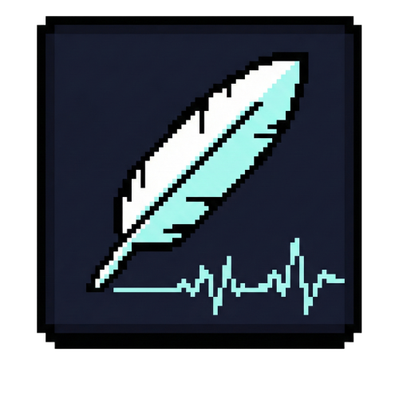

# WordScript


<p align="center">
  
</p>

**One shortcut. Speak. Done.**

WordScript is a lightweight desktop tool that turns speech into text — instantly pasted where your cursor is. Press a hotkey, talk, release. No browser tabs, no app switching, no copy-paste.

---

## What works (v0.1.1-alpha)

- Global hotkey to start/stop recording (tap or hold mode)
- Real-time audio visualizer overlay (pill-shaped, always on top)
- Transcription via Groq Whisper API (~1s turnaround)
- AI post-processing: fixes grammar, punctuation, filler words via LLM
- Auto-paste into any focused application
- Mute toggle (click mic icon in visualizer)
- Full settings UI (API keys, models, audio device, hotkey, prompt — all configurable without touching files)
- System tray icon with status
- Audio feedback sounds (start, stop, abort, error)
- Automatic update check via GitHub Releases
- Per-user config stored in `%APPDATA%\WordScript\` (Windows), `~/.config/WordScript/` (Linux), `~/Library/Application Support/WordScript/` (macOS)
- Cross-platform config and paste logic (Windows, macOS, Linux)

## What doesn't work yet

- AI assistant mode (voice/text questions, screenshot context) — planned
- Switchable AI backends (Claude, local models) — planned
- Electron rebuild for native cross-platform app — planned
- Auto-updater (currently: notification only, manual download)
- No installer — single `.exe` portable binary

---

## Quick Start

### Option A: Download the binary

Grab the latest release for your platform from [Releases](https://github.com/felixontv/WordScript/releases/latest):

| Platform | Download | Notes |
|---|---|---|
| Windows | [WordScript-windows.exe](https://github.com/felixontv/WordScript/releases/latest/download/WordScript-windows.exe) | Portable, no install needed |
| macOS | [WordScript-macos](https://github.com/felixontv/WordScript/releases/latest/download/WordScript-macos) | Run `chmod +x WordScript-macos` first |
| Linux | [WordScript-linux](https://github.com/felixontv/WordScript/releases/latest/download/WordScript-linux) | Run `chmod +x WordScript-linux` first |

1. Download the file for your OS
2. Run it — on first launch, the settings window opens automatically
3. Enter your [Groq API key](https://console.groq.com/keys) and hit Save

> **macOS/Linux:** After downloading, make the binary executable:
> ```bash
> chmod +x WordScript-macos   # or WordScript-linux
> ./WordScript-macos
> ```

### Option B: Run from source

```powershell
git clone https://github.com/felixontv/WordScript.git
cd WordScript
.\setup.ps1          # creates venv, installs deps, copies config template
```

Edit `config.json` with your Groq API key, then:

```bash
python speech_to_text.py
```

---

## Usage

1. **Launch WordScript** — a small pill-shaped visualizer appears near the bottom of your screen.
2. **Press the hotkey** (`Ctrl + Left Win` by default) to start recording. A short beep confirms.
3. **Press again** (tap mode) or **release** (hold mode) to stop. Two beeps confirm.
4. The transcription is pasted into whatever window is focused — typically within 1 second.
5. **Click the mic icon** in the visualizer to mute/unmute.
6. **Click the chevron** (`>`) to open Settings.

To abort a recording: press `Ctrl + Alt` while recording.

---

## Settings

All settings are accessible from the in-app Settings panel (click `>` on the visualizer). No need to edit files manually.

| Setting | Default | Description |
|---|---|---|
| Groq API Key | _(empty)_ | Required. Get one at https://console.groq.com/keys |
| Whisper Model | `whisper-large-v3-turbo` | Speech recognition model |
| Language | _(auto)_ | Language code (`en`, `de`, `fr`, ...) or empty for auto-detect |
| AI Correction | On | Post-process transcription with an LLM to fix errors |
| Correction Model | `llama-3.3-70b-versatile` | LLM used for correction |
| Hotkey | `ctrl_l+win` | Global keyboard shortcut |
| Activation Mode | `tap` | `tap` = toggle, `hold` = push-to-talk |
| Audio Device | _(system default)_ | Select a specific microphone |
| Sample Rate | `24000` | Audio sample rate (Hz) |
| Auto-paste | On | Paste transcription automatically via Ctrl+V / Cmd+V |
| Play Sounds | On | Audio feedback on start/stop/error |
| Tray Icon | On | Show system tray icon |

---

## Hotkey Reference

Combine keys with `+`. Example: `ctrl_l+win`, `ctrl_l+alt_l+space`

| Key | Description |
|---|---|
| `ctrl_l` / `ctrl_r` | Left / Right Ctrl |
| `alt_l` / `alt_r` | Left / Right Alt |
| `shift_l` / `shift_r` | Left / Right Shift |
| `win` / `cmd` | Windows / Command key |
| `f1` – `f12` | Function keys |

---

## Build from Source

```bash
pip install pyinstaller
pyinstaller WordScript.spec --noconfirm
```

Output name depends on your OS: `WordScript-windows.exe`, `WordScript-macos`, or `WordScript-linux` in `dist/`.

Automated builds for all three platforms run via GitHub Actions on every tagged release.

---

## Project Structure

```
speech_to_text.py        Main application (single file)
config.example.json      Config template
config.json              Your local config (gitignored)
WordScript.spec          PyInstaller build spec (cross-platform)
setup.ps1                One-time dev setup script
requirements.txt         Python dependencies
public/                  Logo and font assets
.github/workflows/       CI/CD — auto-builds on tag push
```

---

## Architecture

```
SpeechToTextApp            Main orchestrator
  ├── AudioRecorder        sounddevice mic capture -> WAV
  ├── TranscriptionService Groq Whisper + LLM correction
  ├── TextPaster           Clipboard + paste simulation
  ├── HotkeyManager        pynput global hotkey listener
  ├── VisualizerOverlay    Tkinter always-on-top pill UI
  ├── TrayIcon             pystray system tray (optional)
  └── SoundFeedback        sounddevice notification tones
```

---

## Troubleshooting

| Problem | Fix |
|---|---|
| No audio device found | Check system sound settings, select the correct mic in Settings |
| Hotkey doesn't work | Try running as Administrator. Some apps block Win key combos. |
| Transcription errors | Verify your Groq API key and internet connection |
| 30s+ delay on second use | Should be fixed in v0.1.1-alpha. If it persists, restart the app. |
| Tray icon missing | Ensure `pystray` and `Pillow` are installed |

---

## Brand Assets

The `public/` folder contains logo and wordmark files:

- **`_white` variants** — use on dark backgrounds
- **`_black` variants** — use on light backgrounds

---

## License

[MIT](LICENSE)
